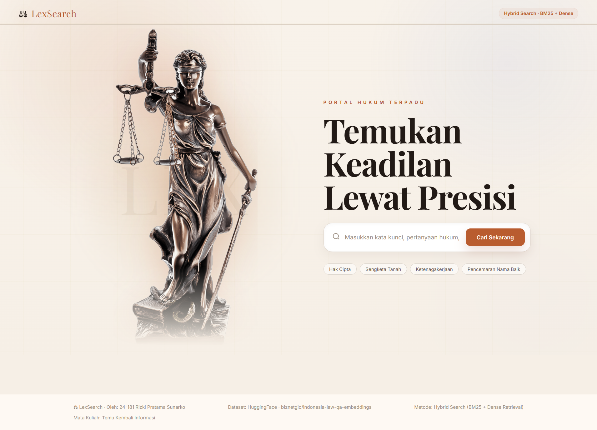

# ⚖️ LexSearch — Search Engine Hukum Indonesia

> Temukan jawaban hukum dengan bahasa sehari-hari, didukung teknologi **Hybrid Search (BM25 + Dense Retrieval)**



---

## 🧠 Tentang Proyek

**LexSearch** adalah aplikasi search engine tematik yang memungkinkan masyarakat mencari informasi hukum Indonesia secara cepat dan relevan menggunakan bahasa sehari-hari. Proyek ini dibangun sebagai tugas akhir (UAS) mata kuliah **Temu Kembali Informasi** dengan menerapkan metode **Hybrid Search** yang menggabungkan BM25 dan Dense Retrieval.

**Latar belakang:** Informasi hukum di Indonesia seringkali sulit diakses masyarakat umum karena menggunakan bahasa formal dan teknis. Metode pencarian konvensional tidak cukup efektif untuk query berbahasa sehari-hari, sehingga dibutuhkan pendekatan yang lebih cerdas secara semantik.

---

## 🔍 Metode: Hybrid Search

```
Hybrid Score = (α × Dense Score) + ((1 - α) × BM25 Score)
```

| Komponen | Library | Cara Kerja |
|---|---|---|
| **BM25** | `rank-bm25` | Lexical matching berbasis frekuensi kata |
| **Dense Retrieval** | `sentence-transformers` | Semantic similarity berbasis embedding vektor |
| **Hybrid** | Keduanya | Gabungan skor dengan bobot alpha (default 0.6) |

- **Alpha = 0.0** → Pure BM25 (cocok untuk query spesifik/nama UU)
- **Alpha = 0.6** → Default, Dense lebih dominan (cocok untuk bahasa sehari-hari)
- **Alpha = 1.0** → Pure Dense (full semantic search)

---

## 📦 Dataset

| Info | Detail |
|---|---|
| **Nama** | indonesia-law-qa-embeddings |
| **Sumber** | [HuggingFace — biznetgio](https://huggingface.co/datasets/biznetgio/indonesia-law-qa-embeddings) |
| **Konten** | hukumonline.com |
| **Jumlah** | 7.170 topik hukum Indonesia |
| **Bahasa** | Bahasa Indonesia |
| **Lisensi** | Apache 2.0 |

**Field utama yang digunakan:**
- `title` — Judul topik hukum
- `question` — Pertanyaan hukum
- `answer` — Jawaban lengkap (293–33.400 karakter)
- `summarize` — Ringkasan jawaban
- `source` — URL sumber artikel

---

## 🛠️ Instalasi & Menjalankan

### Prasyarat
- Python 3.10+
- pip
- Koneksi internet (untuk download dataset & model)

### 1. Clone repository

```bash
git clone https://github.com/rizkisunarko/indonesian-law-search.git
cd indonesian-law-search
```

### 2. Install dependencies

```bash
pip install -r backend/requirements.txt
```

### 3. Download dataset

```bash
python data/download_dataset.py
```

> ⏳ Dataset (~69MB) akan disimpan di `data/hukum_indonesia.csv`

### 4. Build index

```bash
python backend/indexer.py
```

> ⏳ Proses ini membutuhkan beberapa menit (download model ~120MB + hitung 7.170 embeddings). Cukup dijalankan **sekali saja**.

### 5. Jalankan server

```bash
uvicorn backend.main:app --reload --port 8000
```

### 6. Buka di browser

```
http://localhost:8000
```

---

## ✨ Fitur

- 🔍 **Hybrid Search** — Gabungan BM25 + Dense Retrieval untuk hasil yang lebih akurat
- 📊 **3 Similarity Score** — Setiap hasil menampilkan Hybrid Score, Semantik Score, dan BM25 Score
- ⚙️ **Alpha Slider** — Atur bobot Dense vs BM25 secara real-time (0.0 – 1.0)
- 🔢 **Top-K Control** — Atur jumlah hasil pencarian (3–15 dokumen)
- 📖 **Expand Jawaban** — Lihat jawaban lengkap tiap dokumen
- 🔗 **Link Sumber** — Setiap hasil dilengkapi link ke sumber asli hukumonline.com
- 💡 **Suggestion Chip** — Query siap klik untuk memudahkan pencarian

---

## 📁 Struktur File

```
indonesian-law-search/
│
├── dataset_link.txt          # Link Google Drive dataset
├── README.md                 # Dokumentasi ini
├── render.yaml               # Konfigurasi deploy
│
├── data/
│   └── download_dataset.py   # Script download dataset dari HuggingFace
│
├── backend/
│   ├── main.py               # FastAPI application & endpoints
│   ├── search_engine.py      # Logika Hybrid Search (BM25 + Dense)
│   ├── indexer.py            # Build & load index BM25 + embedding
│   ├── requirements.txt      # Library Python
│   ├── bm25_index.pkl        # Index BM25 (hasil build indexer)
│   ├── embeddings.npy        # Dense embeddings (hasil build indexer)
│   └── documents.pkl         # Metadata dokumen (hasil build indexer)
│
├── frontend/
│   ├── index.html            # Halaman utama UI
│   ├── results.html          # Halaman hasil pencarian
│   ├── style.css             # Styling (tema hukum, warm cream)
│   ├── app.js                # Logic JavaScript
│   └── assets/
│       └── gambar.png        # Asset gambar
│
└── docs/                     # Static site untuk GitHub Pages
    ├── index.html
    ├── style.css
    ├── app.js
    └── assets/
```

---

## 🌐 API Endpoints

| Method | Endpoint | Deskripsi |
|---|---|---|
| `GET` | `/` | Halaman utama frontend |
| `GET` | `/api/health` | Status server & index |
| `POST` | `/api/search` | Endpoint pencarian utama |
| `GET` | `/api/stats` | Statistik dataset |
| `GET` | `/docs` | Dokumentasi API otomatis (FastAPI) |

### Contoh Request Search

```json
POST /api/search
{
  "query": "cara mengurus sertifikat tanah",
  "top_k": 10,
  "alpha": 0.6
}
```

### Contoh Response

```json
{
  "query": "cara mengurus sertifikat tanah",
  "total_results": 10,
  "search_time_ms": 243.5,
  "alpha_used": 0.6,
  "results": [
    {
      "title": "Cara Mengurus Sertifikat Tanah Warisan",
      "question": "Bagaimana prosedur mengurus sertifikat tanah warisan?",
      "summarize": "Pengurusan sertifikat tanah warisan dilakukan melalui BPN...",
      "hybrid_score": 0.8821,
      "bm25_score": 0.5210,
      "dense_score": 0.7634,
      "source": "https://hukumonline.com/..."
    }
  ]
}
```

---

## 📚 Library Utama

| Library | Versi | Fungsi |
|---|---|---|
| `fastapi` | 0.115.0 | Web framework backend |
| `uvicorn` | 0.30.6 | ASGI server |
| `rank-bm25` | 0.2.2 | BM25 scoring algorithm |
| `sentence-transformers` | 3.1.1 | Dense embedding model |
| `datasets` | 3.0.1 | Download dataset HuggingFace |
| `pandas` | 2.2.3 | Data processing |
| `numpy` | 1.26.4 | Operasi matrix embedding |

---

## 👤 Author

**Rizki Pratama Sunarko**
Mata Kuliah Temu Kembali Informasi